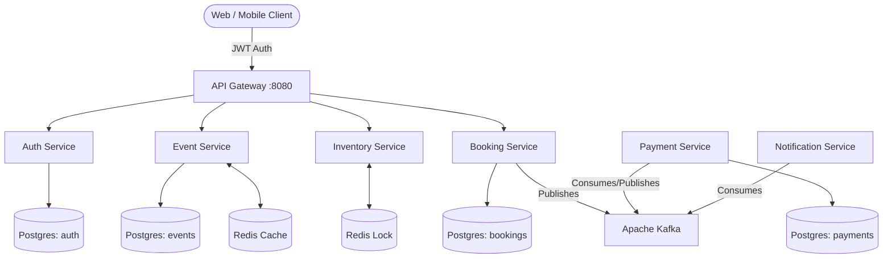

# EventBooking: High-Concurrency Ticketing Platform


A distributed microservices architecture designed to handle massive traffic spikes and concurrent booking requests without data anomalies. 

This project was built to tackle the classic "double-booking" problem in e-commerce and ticketing systems. It implements an event-driven architecture using Apache Kafka and relies on distributed caching and locking to guarantee data integrity at scale.

## Architecture

The platform consists of seven distinct Spring Boot microservices, communicating asynchronously via Kafka and synchronously via a Spring Cloud API Gateway.



## Core Engineering Challenges Solved

### 1. The "Double-Booking" Problem (Race Conditions)
When thousands of users attempt to purchase the same seat simultaneously, standard relational database row-locks can become a bottleneck or fail under heavy concurrent load. 
**Solution:** Implemented distributed locking via Redis (`SET NX EX`). The Inventory Service provides an atomic, mathematically guaranteed lock on a specific seat with a strict TTL (10 minutes) before the payment flow is even initiated.

### 2. Distributed Transactions & Service Coupling
Traditional synchronous REST calls between Booking and Payment services can lead to cascading failures and network timeouts during traffic spikes.
**Solution:** Implemented the **Choreographed Saga Pattern**. The Booking Service persists a `PENDING` state and fires a Kafka event. The Payment Service processes the transaction asynchronously and publishes the result, allowing the Booking Service to finalize the state to `CONFIRMED`. This guarantees eventual consistency while decoupling the services.

### 3. Network Retries and Double-Charging
In event-driven systems, message brokers guarantee "at-least-once" delivery, which can result in the Payment Service receiving the same transaction request multiple times during a network partition.
**Solution:** Enforced strict **Idempotency**. The Payment Service relies on a heavily optimized PostgreSQL `UNIQUE` constraint on the `booking_id`. Any duplicate Kafka messages are safely ignored at the database layer, guaranteeing a user is never double-charged.

### 4. Database Schema Isolation
Managing separate database instances for 6 microservices is resource-intensive, but sharing a single schema violates microservice boundaries.
**Solution:** Configured a single PostgreSQL instance but utilized **Flyway** to execute automated migrations, isolating each microservice into its own logically separated schema upon startup.

## Technology Stack

- **Framework:** Java 17, Spring Boot 3.2
- **Infrastructure:** Fully containerized via Docker and Docker Compose
- **Databases:** PostgreSQL 16, Redis 7.4
- **Event Streaming:** Apache Kafka 3.7 (KRaft mode, Zookeeper-less)
- **Security:** Spring Security, stateless JWT authentication via API Gateway
- **Build Tool:** Maven (Multi-module project)

## Getting Started

The entire architecture is containerized. You do not need to install local databases or message brokers to run this project.

1. **Build the artifacts:**
   ```bash
   mvn clean package -DskipTests
   ```

2. **Spin up the environment:**
   ```bash
   docker compose up --build -d
   ```
   *This single command starts PostgreSQL, Redis, Kafka, and all 7 microservices in their respective containers attached to a shared Docker network.*

3. **Monitor the logs:**
   ```bash
   docker compose logs -f
   ```

4. **API Access:**
   All requests should be routed through the API Gateway at `http://localhost:8080`.
